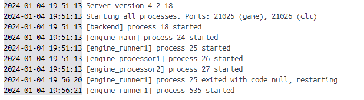
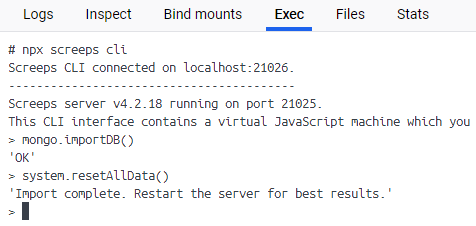

# Screeps:World in Docker

从零开始用Docker搭建Screeps:World私人服务器

## Background

网上已经有了很多关于用docker搭建Screeps:World私服的案例，但是“纸上得来终觉浅，绝知此事要躬行”。看得多了之后也决定自己试试。

## Get Started

### Dependencies

1. 稳定的梯子。不管是拉取docker镜像还是获取Steam API Key都需要梯子，而且这不光是对PC的要求，也是对手机端的要求，Steam API Key的获取还需要手机验证。
2. 系统：带WSL2的windows系统。因为是在Docker里跑，所以具体是什么系统没有很大关系。但一般都在windows下玩Steam，所以我用的windows系统。
3. Docker Desktop，更新到最新版本即可，目前是4.26.1版本。
4. Steam，Screeps:World Client。

### Build

- 如果可以访问dockerhub，可以直接拉取构建完成的镜像：

    ```shell
    docker pull miniball/screeps-server:latest
    ```

    如果需要设置代理，可以修改`/etc/systemd/system/docker.service.d/proxy.conf`
    
    ```
    [Service]
    Environment="HTTP_PROXY=http://127.0.0.1:7890/"
    Environment="HTTPS_PROXY=http://127.0.0.1:7890/"
    Environment="NO_PROXY=localhost,127.0.0.1"
    ```

- 或者也可以从头开始构建。

    基础镜像是官方的debian镜像，debian:buster-slim，在此基础上先搭建基本的node环境，只要有国内镜像源加速应该就可以构建。在`node-10`目录下运行：

    ```shell
    docker build -t <image name>:<tag> .
    ```

    根据构建的node镜像名称，修改[Dockerfile](screeps-server/Dockerfile)中第一行的镜像名。再切换到`screeps-server`目录下进行构建

    ```shell
    docker build -t <image name>:<tag> .
    ```

### Run

创建`docker-compose.yaml`文件，根据[docker-compose.yaml.example](docker-compose.yaml.example)修改一下即可。注意将其中标记有`TODO`的位置。

Server在运行的时候，相关的文件是挂载到镜像上的，这样可以把数据，log都保存在本地。Container释放之后还能保留数据。

配置好`docker-compose.yaml`，创建server和db所需的文件夹后就可以运行啦。

```shell
docker-compose up -d
```

`-d`选项是为了让server在后台运行。

在docker desktop中可以看到正在运行的container的log，第一次启动可能需要比较长的时间，因为需要下载安装之类的。之后启动就比较快了，看到类似这么几个process起来了就好了。



第一次启动docker后，需要启用mongoDB。同样在docker desktop中找到Exec的Tab，执行命令：

```shell
npx screeps cli
```

在出现的命令行界面中依次输入以下命令来启用MongoDB：

```shell
mongo.importDB()
system.resetAllData()
```

会出现如下结果：



接着停止并删除container，再重新启动即可，至此server就搭建完成啦。

## Others

如果想添加其它mod，可以直接在`mods.json`文件中改，然后安装相应的mod。而我为了让server轻量一些，就只选择了[screepsmod-mongo](https://github.com/ScreepsMods/screepsmod-mongo)和[screepsmod-auth](https://github.com/ScreepsMods/screepsmod-auth)这两个我认为是必要的mod。前者可以避免很多奇怪的bug，而后者则是出于以下两个目的。

在使用yarn安装screeps的时候可能会有下载的问题，可以尝试更换yarn源。

```shell
 yarn config set registry https://registry.npmmirror.com
```

手动完成[docker-entrypoint.sh](screeps-server/docker-entrypoint.sh)中init的步骤之后再运行即可。

### Upload Code

有了screepsmod-auth这个mod后，用户可以设置密码，同时也支持从本地上传代码了，用client里的代码编辑器比较痛苦。我在本地用的是[cargo-screeps](https://github.com/rustyscreeps/cargo-screeps)，要传代码到私服的时候需要注意设置用户名，密码，ssl和port。

### Steamless Client

还有一个痛点是从steam启动screeps的client需要好久，所以就有了这个可以脱离steam的client：[screeps-steamless-client](https://github.com/laverdet/screeps-steamless-client)。虽然不用启动steam了，但是它并不是完全脱离steam，还是需要事先在steam上下载好screeps client到本地。但总体来说还是比用steam方便很多。

## Tips

1. 在windows下写shell脚本注意文件的结尾换行符是LF还是CRLF
2. 如果无法通过steam client登录server，可能是Steam API Key没有被验证，就是网不好，可以看server的`logs/benkend.log`
3. 代码无法上传，可能是被错误地代理了，可以用[wireshark](https://www.wireshark.org/)抓包找一下问题。
